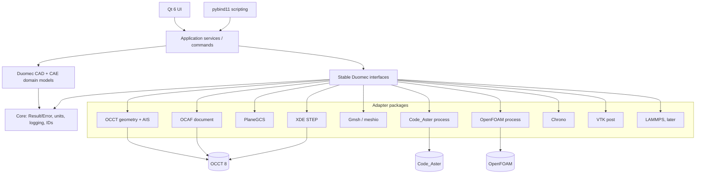

# Component diagram

Dependencies point inward: UI and adapters may depend on interfaces/domain, never the reverse. A subsystem cannot bypass its port to call a solver. Cross-adapter exchange uses Duomec models or versioned files in deterministic job directories.
