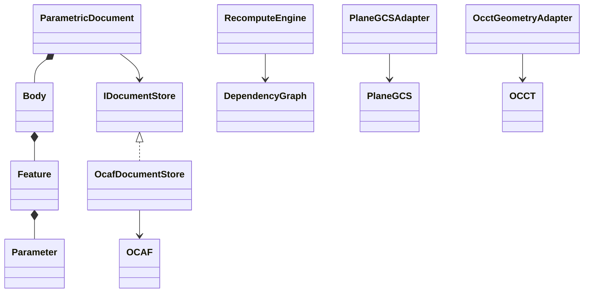

# Milestone 1 component diagram

Only the left-hand domain objects and `IDocumentStore` are visible to application commands. The three adapters contain their respective external headers. Milestone 1A implements the document aggregate and OCAF store only; the remaining classes are sequenced in 1B–1F.
