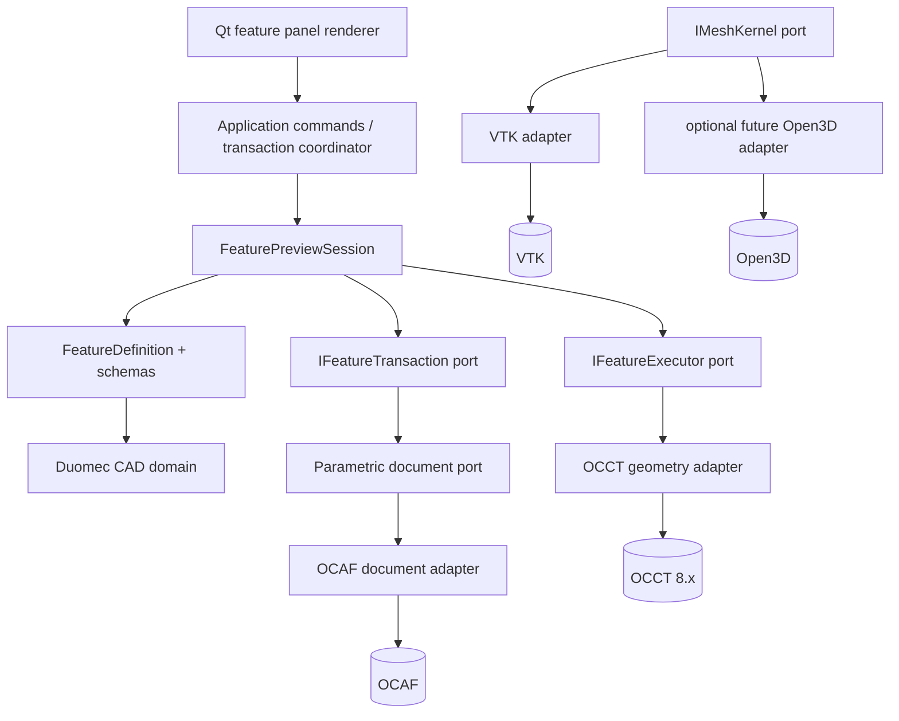

# Milestone 2 dependency diagram

Arrows point from consumer to dependency. UI renders immutable definitions and submits domain values; it cannot execute feature semantics. Domain headers include no Qt, OCCT, OCAF, VTK, or Open3D types. M2A implements the definition, collector, preview-session, executor, and transaction ports only. Adapter boxes beyond the existing OCAF work are future phases.
