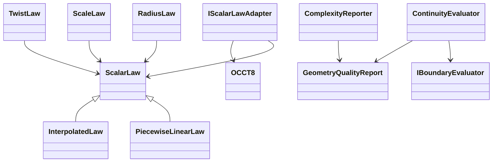

# Milestone 3 geometry-quality dependency diagram

The law, sampling, and reporting types are Duomec domain code and contain no OCCT/OCAF/Qt types. Analytic tests implement `IBoundaryEvaluator`; a future OCCT adapter will sample immutable curve/surface snapshots and translate scalar laws to kernel `Law_Function` objects. Construction settings remain adapter data, while requested intent and measured quality remain domain data.
