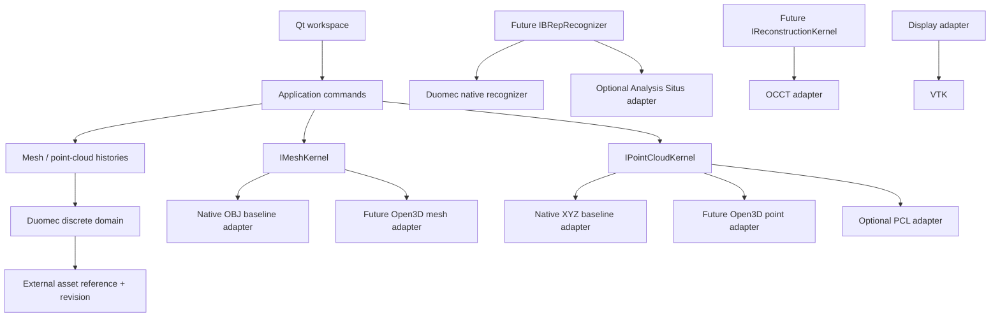

# Milestone 4 discrete-geometry dependency diagram

Domain and history targets contain no Qt, Open3D, VTK, PCL, Analysis Situs, or OCCT types. Backends consume immutable Duomec snapshots and publish new revisions. The native OBJ/XYZ adapters are deliberately narrow bootstrap implementations, not substitutes for the reviewed Open3D production adapter.
